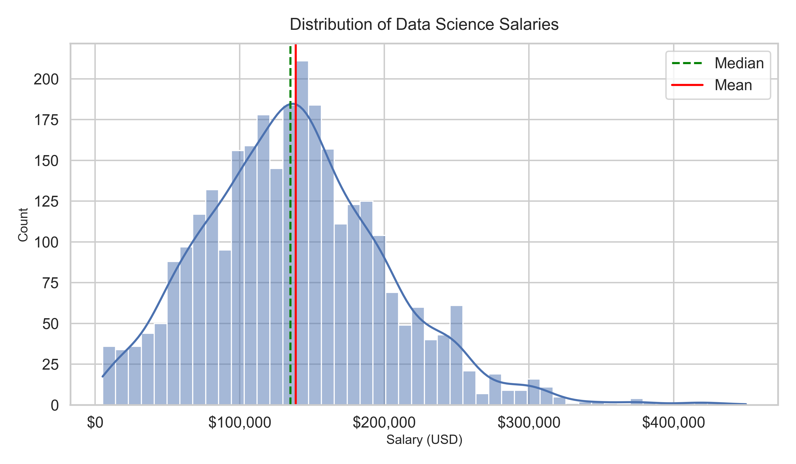
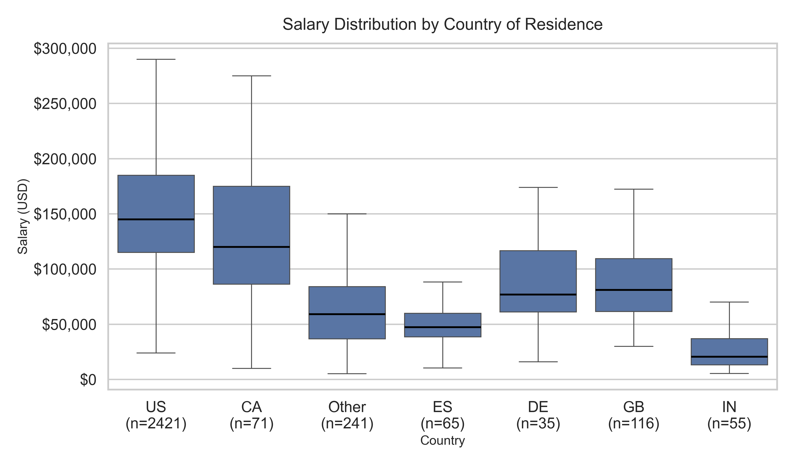
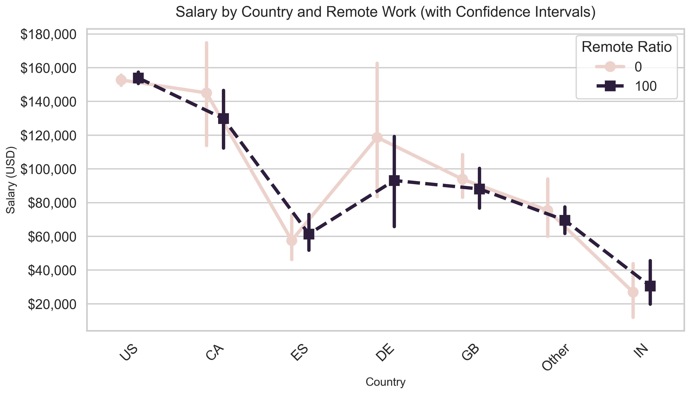
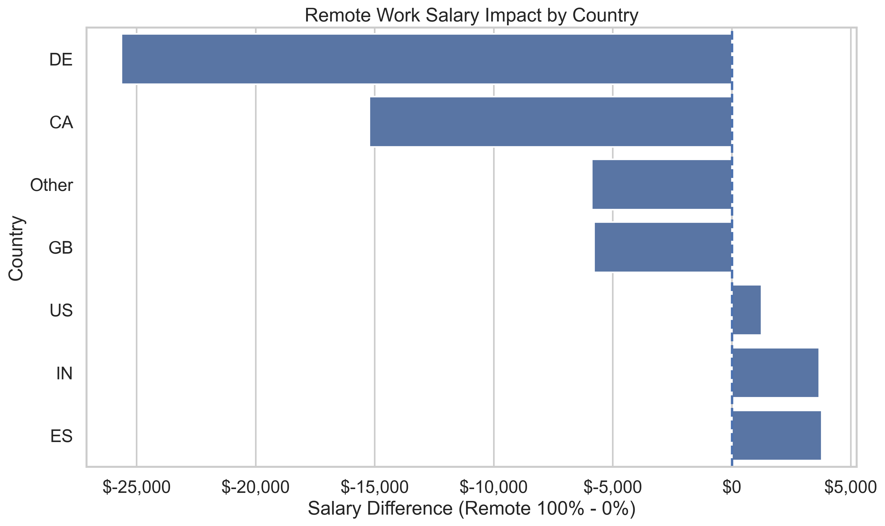

# Data Science Salary Analysis

## Overview

This project analyzes the factors that determine salaries in data science jobs, with a particular focus on **remote work** and **geographic differences**.

---

## Dataset

* Data Science Salaries 2023 (Kaggle)
* 3,755 observations (3,004 in the training dataset)

---

## Objectives

* Identify key drivers of salary
* Examine the impact of remote work
* Analyze global salary differences

---

## Exploratory Data Analysis (EDA)

### Salary Distribution

* The salary distribution is approximately bell-shaped but exhibits slight right skewness due to a small number of high-income observations.
* Consequently, the mean is modestly higher than the median.

### Country-wise Distribution

* Salary distributions differ significantly by country.
* High-income countries such as the United States and Canada exhibit higher median salaries and wider interquartile ranges, indicating greater variability in compensation.
* In contrast, lower-income countries such as India and Spain show lower median salaries and more compact interquartile ranges.
* This boxplot excludes outliers and therefore highlights differences in central tendency and dispersion across countries.
* It is worth noting that the United States also contains many high-income outliers, which are not shown in this figure.

---

## OLS Regression Analysis

### Key Results

#### Time Trend

* Salary increases by approximately **$6,000 per year**
* Possible reasons: AI boom, talent shortage, inflation

#### Remote Work

* Remote ratio alone is **not statistically significant**

#### Employment Type

* Employment type is **not statistically significant** in the final regression model.

#### Company Size

* Small companies (<50 employees) pay about **$15,000 less** than large companies (>250 employees)

#### Job Title Effects (vs Analytics Engineer)

* Applied Scientist: +$31,000
* Data Analyst: −$32,000
* Data Science Manager: +$36,000
* Machine Learning Engineer: +$19,000
* Research Scientist: +$36,000

#### Experience Level (vs Entry-level)

* Mid-level: +$18,000
* Senior-level: +$44,000
* Executive-level: +$91,000

#### Interaction: Job Title × Experience

* No statistically significant interactions
* Likely due to limited sample size and high variance

#### Geographic Effects (vs Canada)

* Spain: −$83,000
* UK: −$30,000
* India: −$75,000
* Other regions: −$60,000

→ Salary strongly depends on **location (cost of living, labor market, industry maturity)**

* Confidence intervals are much narrower for the United States due to a larger sample size, while other countries show higher uncertainty.

#### Same Country Effect

* No significant effect
* Suggests salary depends more on **employee residence** than company location

---

## Remote Work × Country Interaction

* Significant positive effect observed **only in Spain**
* Salary increases by about **$420 per 1% increase in remote ratio**

→ Indicates that the impact of remote work may differ across countries

* When the remote ratio increases from 0% to 100%, the impact on salary differs substantially across countries.
* In lower-income countries such as India and Spain, salaries increase by approximately $3,500. In the United States, the increase is modest at around $1,000.
* In contrast, several higher-income countries show a decrease in salaries: about $6,000 in the United Kingdom and other regions, approximately $15,000 in Canada, and up to $25,000 in Germany.
* These results suggest that the relationship between remote work and salary varies by country, with potential differences between lower- and higher-income regions.
* These patterns are based on descriptive comparisons and should be interpreted with caution, as they do not control for other factors such as job role, experience, or company characteristics.

---

## Controlled Comparison

Under fixed conditions:

* Job: Data Scientist
* Experience: Senior
* Employment: Full-time

→ Salary differences across countries can exceed **3x**

---

## Hypothesis: Does Remote Work Reduce Wage Inequality?

### Observed Patterns

* Low-income countries (India, Spain): slight salary increase with remote work
* High-income countries (Canada, Germany, UK): salary decrease
* United States: almost no change

### Important Note

* These patterns are based on descriptive analysis
* Regression results show limited statistical significance

---

## Key Findings

* Salaries vary significantly across countries
* Experience level has a strong impact on salary
* Remote work alone is not a significant factor
* The effect of remote work may differ by country (Spain shows significance)
* The U.S. has highly reliable estimates due to large sample size

---

## Model Comparison

### OLS (Statsmodels)

* R²: 0.440
* RMSE: 44,991

### Linear Regression

* R²: 0.443
* RMSE: 44,886

### Random Forest

* R²: 0.431
* RMSE: 45,353
* Top feature: `employee_residence_mod_US`

### LightGBM

* R²: 0.449
* RMSE: 44,619
* Top features: `work_year`, `remote_ratio`, `company_size`

→ LightGBM achieved the best performance among the models. Linear Regression also performed competitively, while OLS provided more interpretable coefficients. Tree-based models showed comparable performance but revealed different feature importance patterns.

---

## Limitations

* Observational data (no causal inference)
* Sample size imbalance across countries
* Company location effects not fully explored
* Remote work mechanism cannot be directly identified

---

## Conclusion

This analysis shows that:

* **Geography and experience** are the strongest determinants of salary
* Remote work alone does not significantly affect salary
* However, its impact may vary across countries

The findings highlight the complexity of global labor markets in data science.

---

## Future Work

* Include company location interactions
* Apply log-transformed models more robustly
* Apply causal inference methods (e.g., propensity score matching) to better estimate causal effects
* Analyze remote work effects within specific job roles

---
